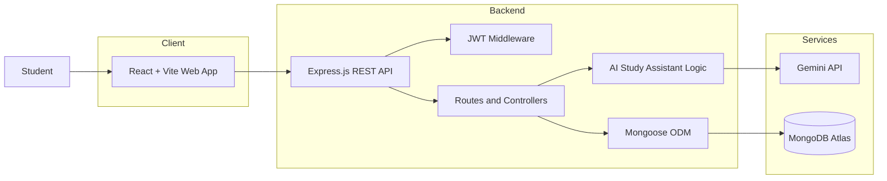
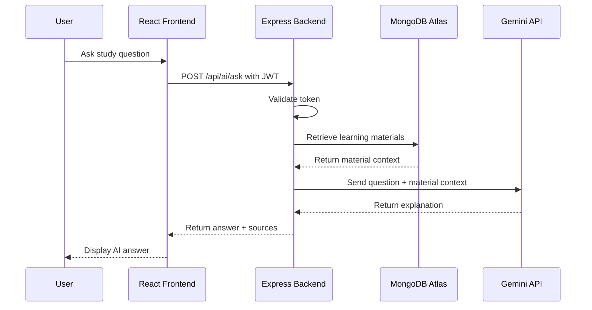
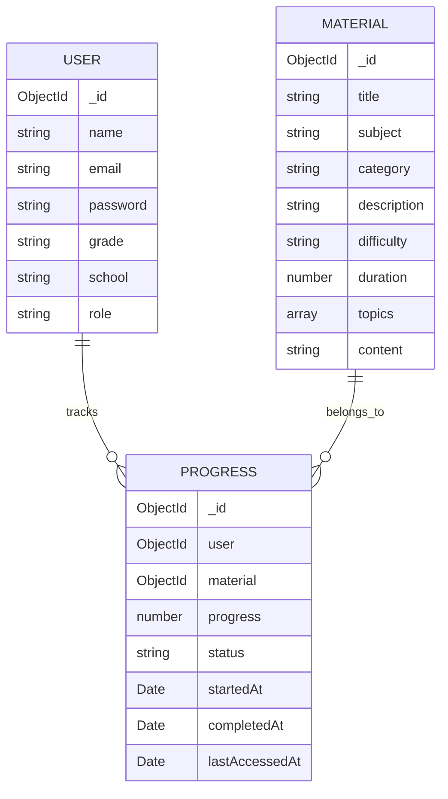
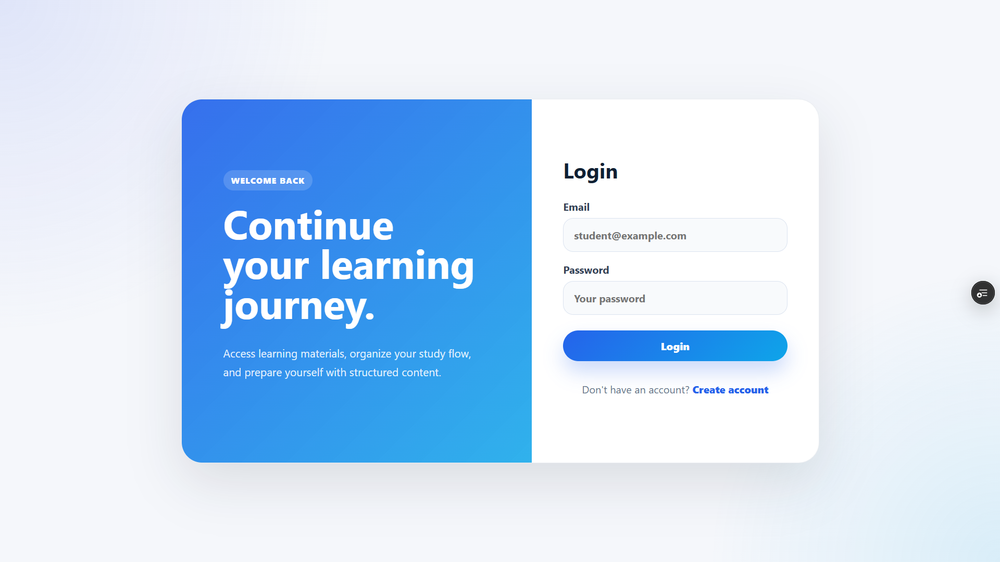

# Learning Support Platform

**Learning Support Platform** is a fullstack web application that helps high school students access structured learning materials, track completed materials, and ask questions through an AI Study Assistant.

This project was built as a software engineering portfolio project to practice real product development: user authentication, REST API integration, MongoDB data modeling, protected routing, deployment, progress tracking, and backend-based AI integration.

---

## Live Demo

- **Web App:** https://learning-support-platform-4q3x.vercel.app
- **Backend API Health Check:** https://learning-support-platform-six.vercel.app/api/health

---

## Portfolio Summary

Many students prepare for exams using scattered notes, files, and websites. This makes it difficult to find the right material, continue learning consistently, and remember which topics have already been completed.

Learning Support Platform solves this by providing one dashboard where students can:

- Register and log in securely
- Browse structured learning materials
- Search and filter materials by subject
- Open material detail pages
- Mark materials as completed
- Track completed learning progress
- Ask questions through an AI Study Assistant

---

## My Role

My role in this project was **Fullstack Developer**.

I worked on:

- Designing the web frontend with React and Vite
- Building the backend REST API with Express.js
- Creating MongoDB models using Mongoose
- Implementing JWT authentication and protected routes
- Connecting frontend and backend using Axios
- Building user-based progress tracking
- Integrating Gemini API through the backend for the AI Study Assistant
- Deploying the frontend and backend with Vercel
- Debugging CORS, environment variables, and production API issues
- Writing portfolio documentation and manual testing notes

---

## Main Features

### Authentication

- Student registration
- Student login
- JWT-based authentication
- Protected dashboard and material routes
- Persistent session using local storage
- Logout functionality

### Learning Materials

- Learning material list
- Material detail page
- Search by keyword
- Filter by subject
- Difficulty badge
- Estimated duration
- Related materials by subject

### Learning Progress

- Mark material as completed
- Reset completed progress
- View completed material count on dashboard
- Store progress per authenticated user
- Track relationship between user and material

### AI Study Assistant

- Ask questions about available learning materials
- Generate simple study explanations
- Use MongoDB learning materials as context
- Return related material sources
- Handle AI quota/API errors gracefully
- Keep the AI API key safely on the backend

---

## Tech Stack

### Backend

- Node.js
- Express.js
- MongoDB Atlas
- Mongoose
- JSON Web Token
- bcryptjs
- CORS
- dotenv
- Gemini API

### Frontend

- React
- Vite
- React Router
- Axios
- CSS

### Deployment

- Vercel for frontend
- Vercel for backend API
- MongoDB Atlas for cloud database

---

## System Architecture



---

## AI Study Assistant Flow



---

## Data Relationship



---

## Project Structure

```txt
learning-support-platform/
├── Back-end/
│   ├── config/
│   ├── controllers/
│   ├── middleware/
│   ├── models/
│   ├── routes/
│   ├── .env.example
│   ├── app.js
│   ├── package.json
│   ├── seed.js
│   └── server.js
│
├── Front-end/
│   ├── public/
│   ├── src/
│   │   ├── components/
│   │   ├── context/
│   │   ├── pages/
│   │   ├── services/
│   │   ├── App.jsx
│   │   └── main.jsx
│   ├── .env.example
│   └── package.json
│
├── docs/
│   ├── case-study.md
│   ├── testing.md
│   ├── testing-ai.md
│   └── screenshots
│
├── .gitignore
└── README.md
```

---

## API Endpoints

### Auth Routes

| Method | Endpoint | Description |
| --- | --- | --- |
| POST | `/api/auth/register` | Register a new student |
| POST | `/api/auth/login` | Login student |
| GET | `/api/auth/me` | Get current authenticated user |

### Material Routes

| Method | Endpoint | Description |
| --- | --- | --- |
| GET | `/api/courses` | Get all learning materials |
| GET | `/api/courses/:id` | Get material detail by ID |

### Progress Routes

| Method | Endpoint | Description |
| --- | --- | --- |
| GET | `/api/progress` | Get current user's learning progress |
| POST | `/api/progress/:materialId/start` | Start a material |
| POST | `/api/progress/:materialId/complete` | Mark material as completed |
| PATCH | `/api/progress/:materialId` | Update material progress percentage |
| DELETE | `/api/progress/:materialId` | Reset material progress |

### AI Routes

| Method | Endpoint | Description |
| --- | --- | --- |
| POST | `/api/ai/ask` | Ask AI Study Assistant using material context |

---

## Getting Started

### 1. Clone Repository

```bash
git clone https://github.com/theo00000/learning-support-platform.git
cd learning-support-platform
```

### 2. Backend Setup

```bash
cd Back-end
npm install
cp .env.example .env
npm run seed
npm run dev
```

Backend runs on:

```txt
http://localhost:5000
```

Backend `.env` example:

```env
PORT=5000
MONGO_URI=your_mongodb_connection_string
JWT_SECRET=your_random_jwt_secret
CLIENT_ORIGIN=http://localhost:5173
GEMINI_API_KEY=your_gemini_api_key
GEMINI_MODEL=gemini-1.5-flash
```

### 3. Frontend Setup

```bash
cd Front-end
npm install
cp .env.example .env
npm run dev
```

Frontend runs on:

```txt
http://localhost:5173
```

Frontend `.env` example:

```env
VITE_API_BASE_URL=http://localhost:5000/api
```

---

## Deployment Notes

### Backend Environment Variables

```env
MONGO_URI=your_mongodb_atlas_connection_string
JWT_SECRET=your_random_jwt_secret
CLIENT_ORIGIN=https://learning-support-platform-4q3x.vercel.app
GEMINI_API_KEY=your_gemini_api_key
GEMINI_MODEL=gemini-1.5-flash
```

### Frontend Environment Variables

```env
VITE_API_BASE_URL=https://learning-support-platform-six.vercel.app/api
```

---

## Screenshots

### Register Page


### Login Page



### Dashboard


### Material Detail


---

## Testing Documentation

Manual testing documentation is available in the `docs/` folder:

- [`docs/testing.md`](docs/testing.md)
- [`docs/testing-ai.md`](docs/testing-ai.md)
- [`docs/case-study.md`](docs/case-study.md)

The tested flow includes:

```txt
Register → Login → Dashboard → Search/Filter Materials → Material Detail → Mark Done → Ask AI → Logout
```

---

## Security Notes

- Real `.env` files are not included in this repository.
- API keys and database credentials must be configured through local or deployment environment variables.
- Passwords are hashed using bcryptjs.
- Protected routes require JWT authentication.
- The AI API key is stored only on the backend and is not exposed to the frontend.

For production-level improvement, authentication can be strengthened using httpOnly cookies, refresh token rotation, rate limiting, and stronger authorization rules.

---

## What I Learned

Through this project, I learned how to:

- Build a fullstack web application
- Structure backend code using routes, controllers, models, and middleware
- Implement JWT authentication
- Hash passwords securely
- Connect React frontend with Express backend
- Model user-to-material progress data in MongoDB
- Integrate an AI API from the backend
- Handle loading, error, and empty states
- Deploy frontend and backend separately
- Debug CORS and environment variable issues
- Write clearer technical documentation for portfolio presentation

---

## Future Improvements

- Add progress percentage visualization
- Add bookmark or saved materials feature
- Add admin dashboard for managing materials
- Add role-based access control
- Add learning history
- Add unit and integration tests
- Add API documentation using Postman or Swagger
- Improve AI response formatting
- Improve authentication security using httpOnly cookies

---

## Author

**Wesly Rismahadi**

- GitHub: [github.com/theo00000](https://github.com/theo00000)
- Instagram: [@wslyadm](https://instagram.com/wslyadm)

---

## Portfolio Description

Learning Support Platform is a fullstack web application designed to help students access structured learning materials, track completed study materials, and ask questions through an AI Study Assistant. I built this project to practice software engineering fundamentals such as authentication, REST API integration, MongoDB data modeling, protected routing, deployment, user-based progress tracking, and AI API integration.

This project represents my learning journey in building practical digital products that solve real user problems.
