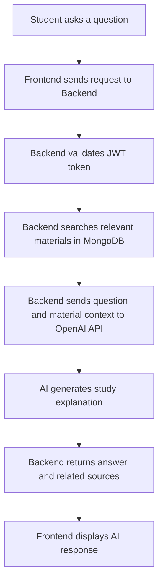
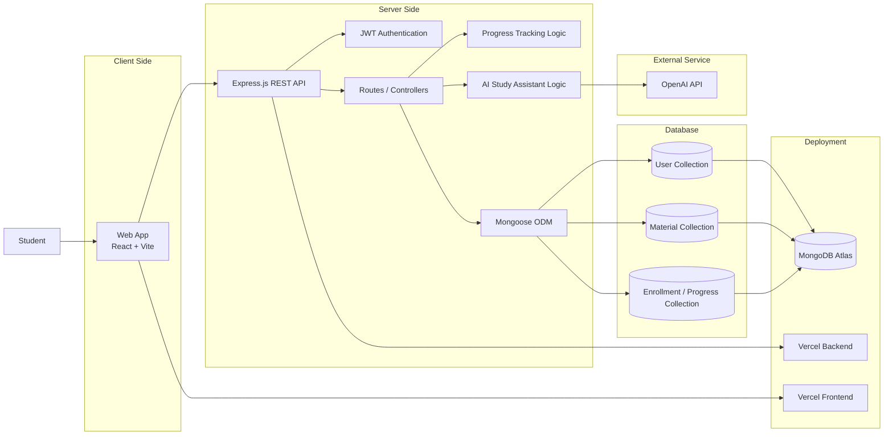
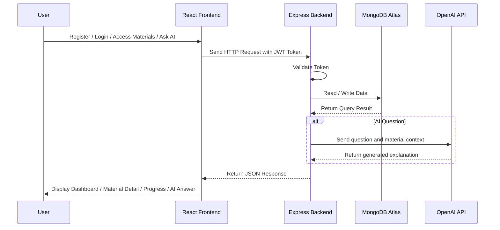
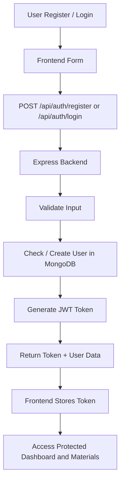
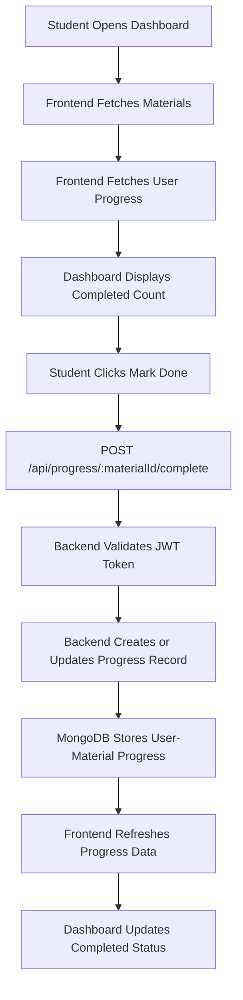
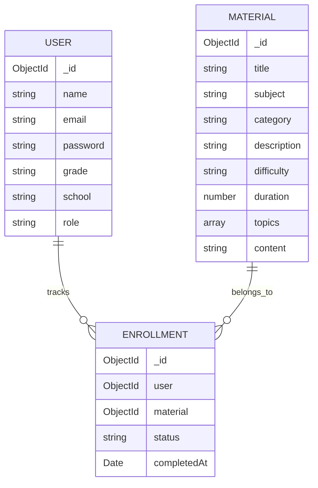
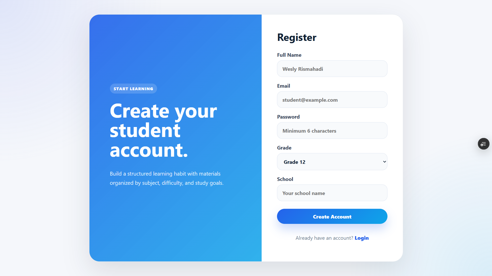
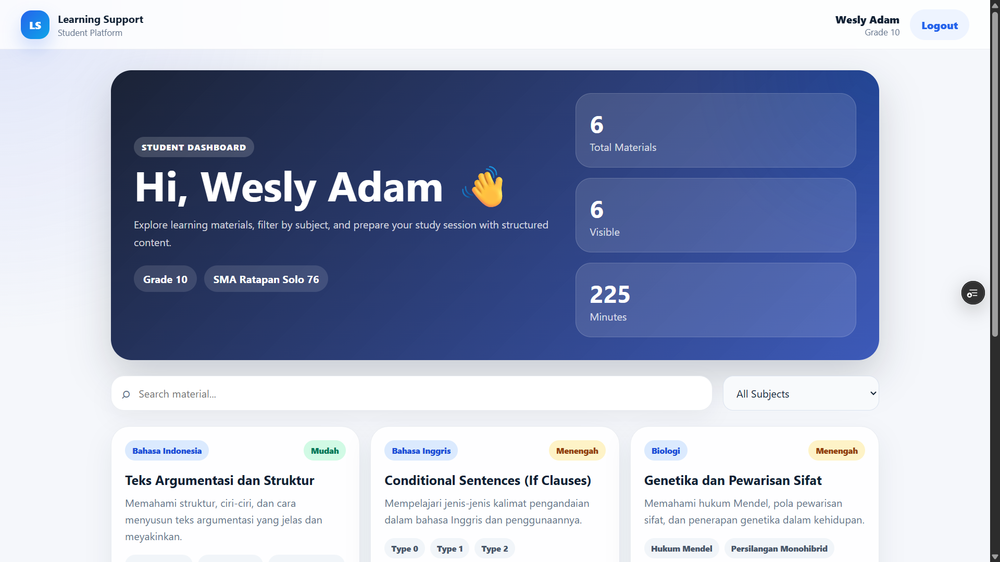
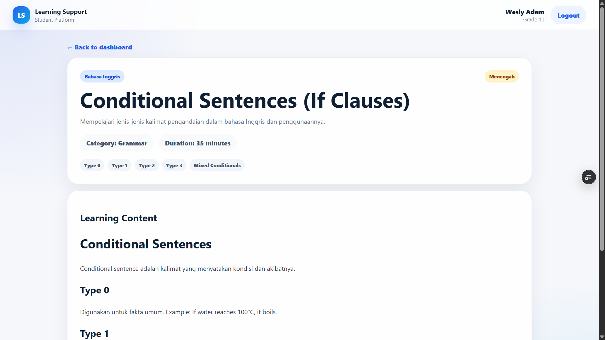

# Learning Support Platform

**Learning Support Platform** is a fullstack web learning application designed to help high school students access structured learning materials, track their study progress, and ask questions through an AI-powered study assistant.

This project was built as a software engineering portfolio project to practice fullstack development, authentication flow, REST API integration, MongoDB data modeling, deployment, AI API integration, and user-based progress tracking.

---

## Live Demo

- **Web App:** https://learning-support-platform-4q3x.vercel.app
- **Backend API Health Check:** https://learning-support-platform-six.vercel.app/api/health

---

## Problem Statement

High school students often need a simple and organized way to access learning materials, especially when preparing for exams. Learning resources can be scattered across different platforms, making it harder for students to find the right material based on subject, difficulty, and available study time.

Another common problem is that students often lose track of which materials they have already completed. Without progress tracking, it becomes harder to plan study sessions and continue learning consistently.

Learning Support Platform was created to solve this problem by providing a centralized learning dashboard where students can access structured materials, search by keyword, filter by subject, open detailed learning content, mark materials as completed, and ask questions using an AI Study Assistant.

---

## Project Overview

Learning Support Platform provides students with an accessible platform to register, login, browse learning materials, filter materials by subject, view detailed learning content, track completed materials, and receive AI-generated study explanations based on available learning materials.

The project consists of two main parts:

- **Backend API** built with Node.js, Express.js, MongoDB, JWT authentication, and OpenAI API integration
- **Web Frontend** built with React and Vite

---

## Main Features

### Authentication

- Student registration
- Student login
- JWT-based authentication
- Protected routes
- Persistent session on the web app
- Logout functionality

### Learning Materials

- List of learning materials
- Material detail page
- Search materials by keyword
- Filter materials by subject
- Difficulty badge
- Duration information
- Related materials by subject

### Learning Progress

- Mark material as completed
- Reset completed material progress
- View completed material count on dashboard
- Store progress per authenticated user
- Track relationship between user and material

### AI Study Assistant

- Ask questions about learning materials
- Generate simple AI explanations
- Use existing learning materials from MongoDB as context
- Display related material sources
- Handle AI quota or API errors gracefully
- Keep the OpenAI API key safely on the backend

---

## AI Study Assistant

The **AI Study Assistant** helps students ask questions about available learning materials. When a student submits a question, the frontend sends the request to the backend. The backend validates the user's JWT token, retrieves relevant materials from MongoDB, sends the question and material context to the OpenAI API, and returns an answer with related sources.

This feature is designed to help students understand learning materials more easily through simple explanations, key points, study tips, and relevant material references.

### AI Feature Flow



### AI Route

| Method | Endpoint      | Description                                            |
| ------ | ------------- | ------------------------------------------------------ |
| POST   | `/api/ai/ask` | Ask AI Study Assistant using learning material context |

### AI Request Example

```json
{
  "question": "Jelaskan materi matematika dengan bahasa sederhana"
}
```

### AI Response Example

```json
{
  "question": "Jelaskan materi matematika dengan bahasa sederhana",
  "answer": "Generated explanation from AI...",
  "sources": [
    {
      "id": "material_id",
      "title": "Material title",
      "subject": "Matematika"
    }
  ]
}
```

### AI Error Handling

If the OpenAI API quota is unavailable, billing is not active, or the AI service returns an error, the backend handles the issue gracefully and returns a clear error message instead of crashing the application.

---

## Tech Stack

### Backend

- Node.js
- Express.js
- MongoDB
- Mongoose
- JSON Web Token
- bcryptjs
- CORS
- dotenv
- OpenAI API

### Web Frontend

- React
- Vite
- React Router
- Axios
- CSS

### Deployment

- Vercel for web frontend
- Vercel for backend API
- MongoDB Atlas for cloud database

---

## Project Structure

```txt
learning-support-platform/
├── Back-end/
│   ├── config/
│   ├── controllers/
│   ├── middleware/
│   ├── models/
│   ├── routes/
│   ├── .env.example
│   ├── package.json
│   ├── seed.js
│   └── server.js
│
├── Front-end/
│   ├── src/
│   │   ├── components/
│   │   ├── context/
│   │   ├── pages/
│   │   ├── services/
│   │   ├── App.jsx
│   │   ├── main.jsx
│   │   └── index.css
│   ├── .env.example
│   └── package.json
│
├── docs/
│   ├── register.png
│   ├── dashboard.png
│   ├── material-detail.png
│   └── testing documentation
│
├── .gitignore
└── README.md
```

---

## System Architecture



The web frontend communicates with the backend through REST API endpoints. Authentication is handled using JWT tokens, which are stored locally on the client side. The backend connects to MongoDB Atlas for user, material, and progress data. The AI Study Assistant uses material data as context before generating a response through the OpenAI API.

---

## Request Flow



---

## Authentication Flow



---

## Learning Progress Flow



---

## Data Relationship



---

## API Endpoints

### Auth Routes

| Method | Endpoint             | Description                    |
| ------ | -------------------- | ------------------------------ |
| POST   | `/api/auth/register` | Register a new student         |
| POST   | `/api/auth/login`    | Login student                  |
| GET    | `/api/auth/me`       | Get current authenticated user |

### Material Routes

| Method | Endpoint           | Description                |
| ------ | ------------------ | -------------------------- |
| GET    | `/api/courses`     | Get all learning materials |
| GET    | `/api/courses/:id` | Get material detail by ID  |

### Lesson Routes

| Method | Endpoint           | Description       |
| ------ | ------------------ | ----------------- |
| GET    | `/api/lessons`     | Get all lessons   |
| GET    | `/api/lessons/:id` | Get lesson detail |
| POST   | `/api/lessons`     | Create lesson     |
| PUT    | `/api/lessons/:id` | Update lesson     |
| DELETE | `/api/lessons/:id` | Delete lesson     |

### Progress Routes

| Method | Endpoint                             | Description                          |
| ------ | ------------------------------------ | ------------------------------------ |
| GET    | `/api/progress`                      | Get current user's learning progress |
| POST   | `/api/progress/:materialId/complete` | Mark material as completed           |
| DELETE | `/api/progress/:materialId`          | Reset material progress              |

### AI Routes

| Method | Endpoint      | Description                                            |
| ------ | ------------- | ------------------------------------------------------ |
| POST   | `/api/ai/ask` | Ask AI Study Assistant using learning material context |

---

## Getting Started

### 1. Clone Repository

```bash
git clone https://github.com/theo00000/learning-support-platform.git
cd learning-support-platform
```

---

## Backend Setup

Go to backend folder:

```bash
cd Back-end
```

Install dependencies:

```bash
npm install
```

Create `.env` file:

```bash
cp .env.example .env
```

Fill your `.env` file:

```env
PORT=5000
MONGO_URI=your_mongodb_connection_string
JWT_SECRET=your_random_secret_key
CLIENT_ORIGIN=http://localhost:5173
OPENAI_API_KEY=your_openai_api_key
```

Seed database:

```bash
npm run seed
```

Run backend server:

```bash
npm run dev
```

Backend will run on:

```txt
http://localhost:5000
```

Health check:

```txt
GET http://localhost:5000/api/health
```

Expected response:

```json
{
  "status": "ok",
  "service": "learning-support-platform-api"
}
```

---

## Web Frontend Setup

Go to frontend folder:

```bash
cd Front-end
```

Install dependencies:

```bash
npm install
```

Create `.env` file:

```bash
cp .env.example .env
```

Fill your `.env` file:

```env
VITE_API_BASE_URL=http://localhost:5000/api
```

Run frontend:

```bash
npm run dev
```

Frontend will run on:

```txt
http://localhost:5173
```

---

## Environment Variables

### Backend `.env`

```env
PORT=5000
MONGO_URI=your_mongodb_connection_string
JWT_SECRET=your_random_secret_key
CLIENT_ORIGIN=http://localhost:5173
OPENAI_API_KEY=your_openai_api_key
```

### Web Frontend `.env`

```env
VITE_API_BASE_URL=http://localhost:5000/api
```

---

## Deployment

### Backend Deployment

The backend is deployed on Vercel.

Required environment variables:

```env
MONGO_URI=your_mongodb_atlas_connection_string
JWT_SECRET=your_random_secret_key
CLIENT_ORIGIN=https://learning-support-platform-4q3x.vercel.app
OPENAI_API_KEY=your_openai_api_key
```

Backend health check:

```txt
https://learning-support-platform-six.vercel.app/api/health
```

### Frontend Deployment

The frontend is deployed on Vercel.

Required environment variable:

```env
VITE_API_BASE_URL=https://learning-support-platform-six.vercel.app/api
```

### CORS Configuration

The backend uses `CLIENT_ORIGIN` to allow requests from the frontend domain.

Example:

```env
CLIENT_ORIGIN=http://localhost:5173,https://learning-support-platform-4q3x.vercel.app
```

---

## Screenshots

### Register Page



### Dashboard



### Material Detail



---

## Testing Documentation

Testing documentation is stored in the `docs/` folder. The testing documentation covers the main user flows, including authentication, protected routes, dashboard access, material detail page, progress tracking, and AI Study Assistant behavior.

The AI Study Assistant testing focuses on:

- Asking a question from the frontend
- Sending the question to the backend
- Validating authenticated access
- Retrieving relevant material sources
- Returning an AI-generated answer
- Handling API quota or service errors gracefully

---

## What I Learned

Through this project, I learned how to:

- Build REST API using Express.js
- Connect backend with MongoDB using Mongoose
- Implement JWT authentication
- Hash passwords using bcryptjs
- Protect API routes with middleware
- Connect React frontend with backend API
- Store authentication sessions on the client side
- Structure a fullstack project more maintainably
- Build user-based progress tracking with MongoDB relationships
- Deploy frontend and backend using Vercel
- Debug CORS issues in production
- Manage environment variables across local and production environments
- Integrate an AI-powered study assistant with backend API
- Use existing learning materials as AI context
- Safely call AI API from the backend without exposing API keys on the frontend
- Implement AI error handling for quota and API failures

---

## Software Engineering Focus

This project focuses on more than just coding. It also emphasizes:

- Clear folder structure
- Separation of concerns
- Route-controller-model backend pattern
- API-based application flow
- Authentication and authorization basics
- Data consistency between frontend, backend, and database
- User-to-material progress relationship
- Error handling and loading states
- Environment variable management
- Deployment and production debugging
- Portfolio-ready documentation

---

## Future Improvements

Planned improvements:

- Improve progress visualization with percentage charts
- Add learning streaks or weekly study summary
- Add bookmark or saved materials feature
- Add admin dashboard for managing materials
- Add role-based access control
- Add unit and integration testing
- Add API documentation using Postman or Swagger
- Improve AI answer formatting
- Add profile editing feature
- Add secure token handling improvement for production usage

---

## Project Status

This project is currently under active development as a software engineering portfolio project.

Current status:

```txt
Backend API         : Completed basic version
Web Frontend        : Completed basic version
Authentication      : Implemented
Material Dashboard  : Implemented
Material Detail     : Implemented
Progress Tracking   : Implemented
Deployment          : Implemented
AI Study Assistant  : Implemented
```

---

## Security Notes

This project uses JWT for authentication. For learning and portfolio purposes, tokens are stored locally on the client side.

The OpenAI API key is stored only in the backend environment variable and is not exposed to the frontend.

For a production-level application, future improvements may include:

- Using httpOnly cookies for web authentication
- Adding refresh token handling
- Adding stronger role-based authorization
- Adding rate limiting for authentication routes
- Adding rate limiting for AI requests

---

## Author

**Wesly Rismahadi**

- GitHub: [github.com/theo00000](https://github.com/theo00000)
- Instagram: [@wslyadm](https://instagram.com/wslyadm)

---

## Portfolio Description

Learning Support Platform is a fullstack web application designed to help students access structured learning materials, track completed study materials, and ask questions through an AI Study Assistant. I built this project to practice software engineering fundamentals such as authentication, REST API integration, MongoDB data modeling, protected routing, deployment, user-based progress tracking, and AI API integration.

This project represents my learning journey in building practical digital products that solve real user problems.
