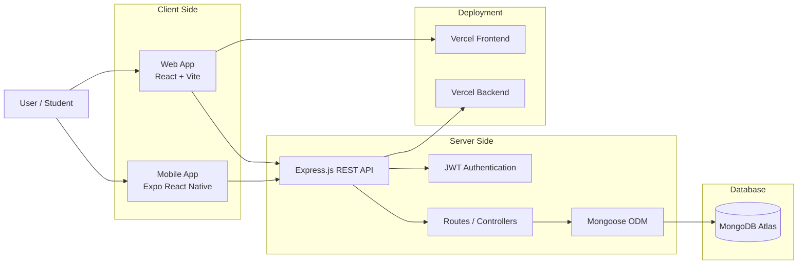
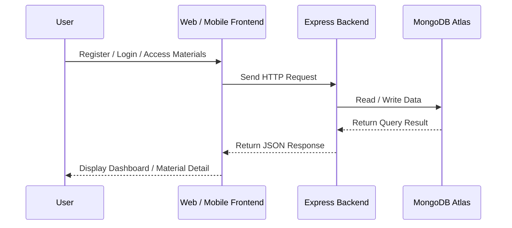
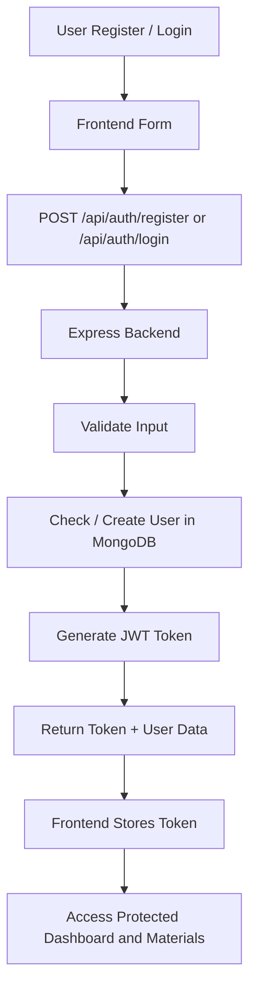

# Learning Support Platform

**Learning Support Platform** is a fullstack web and mobile learning application designed to help high school students access structured learning materials based on subject, difficulty, and study goals.

This project was built as a software engineering portfolio project to practice fullstack development, authentication flow, REST API integration, database modeling, deployment, and cross-platform user experience.

---

## Live Demo

* **Web App:** https://learning-support-platform-4q3x.vercel.app
* **Backend API Health Check:** https://learning-support-platform-six.vercel.app/api/health

---

## Problem Statement

High school students often need a simple and organized way to access learning materials, especially when preparing for exams. Learning resources can be scattered across different platforms, making it harder for students to find the right material based on subject, difficulty, and available study time.

Learning Support Platform was created to solve this problem by providing a centralized learning dashboard where students can access structured materials, filter by subject, search by keyword, and view detailed learning content.

---

## Project Overview

Learning Support Platform provides students with an accessible platform to register, login, browse learning materials, filter materials by subject, and open detailed learning content.

The project consists of three main parts:

* **Backend API** built with Node.js, Express.js, MongoDB, and JWT authentication
* **Web Frontend** built with React and Vite
* **Mobile App** built with Expo React Native

---

## Features

### Authentication

* Student registration
* Student login
* JWT-based authentication
* Protected routes
* Persistent session on web and mobile
* Logout functionality

### Learning Materials

* List of learning materials
* Material detail page
* Search materials by keyword
* Filter materials by subject
* Difficulty badge
* Duration information
* Related materials by subject

### Platform Support

* Web application
* Mobile application
* REST API backend
* MongoDB database integration
* Deployed backend and frontend using Vercel

---

## Tech Stack

### Backend

* Node.js
* Express.js
* MongoDB
* Mongoose
* JSON Web Token
* bcryptjs
* CORS
* dotenv

### Web Frontend

* React
* Vite
* React Router
* Axios
* CSS

### Mobile App

* Expo
* React Native
* React Navigation
* Axios
* AsyncStorage

### Deployment

* Vercel for web frontend
* Vercel for backend API
* MongoDB Atlas for cloud database

---

## Project Structure

```txt
learning-support-platform/
├── Back-end/
│   ├── config/
│   ├── controllers/
│   ├── middleware/
│   ├── models/
│   ├── routes/
│   ├── .env.example
│   ├── package.json
│   ├── seed.js
│   └── server.js
│
├── Front-end/
│   ├── src/
│   │   ├── components/
│   │   ├── context/
│   │   ├── pages/
│   │   ├── services/
│   │   ├── App.jsx
│   │   ├── main.jsx
│   │   └── index.css
│   ├── .env.example
│   └── package.json
│
├── my-learning-app/
│   ├── src/
│   │   ├── context/
│   │   ├── screens/
│   │   ├── services/
│   │   └── styles/
│   ├── App.js
│   ├── app.json
│   └── package.json
│
└── README.md
```

---

## System Architecture



The web frontend and mobile app communicate with the backend through REST API endpoints. Authentication is handled using JWT tokens, which are stored locally on the client side.

---

## Request Flow



---

## Authentication Flow



---

## API Endpoints

### Auth Routes

| Method | Endpoint             | Description                    |
| ------ | -------------------- | ------------------------------ |
| POST   | `/api/auth/register` | Register a new student         |
| POST   | `/api/auth/login`    | Login student                  |
| GET    | `/api/auth/me`       | Get current authenticated user |

### Material Routes

| Method | Endpoint           | Description                |
| ------ | ------------------ | -------------------------- |
| GET    | `/api/courses`     | Get all learning materials |
| GET    | `/api/courses/:id` | Get material detail by ID  |

### Lesson Routes

| Method | Endpoint           | Description       |
| ------ | ------------------ | ----------------- |
| GET    | `/api/lessons`     | Get all lessons   |
| GET    | `/api/lessons/:id` | Get lesson detail |
| POST   | `/api/lessons`     | Create lesson     |
| PUT    | `/api/lessons/:id` | Update lesson     |
| DELETE | `/api/lessons/:id` | Delete lesson     |

---

## Getting Started

### 1. Clone Repository

```bash
git clone https://github.com/theo00000/learning-support-platform.git
cd learning-support-platform
```

---

## Backend Setup

Go to backend folder:

```bash
cd Back-end
```

Install dependencies:

```bash
npm install
```

Create `.env` file:

```bash
cp .env.example .env
```

Fill your `.env` file:

```env
PORT=5000
MONGO_URI=your_mongodb_connection_string
JWT_SECRET=your_random_secret_key
CLIENT_ORIGIN=http://localhost:5173
```

Seed database:

```bash
npm run seed
```

Run backend server:

```bash
npm run dev
```

Backend will run on:

```txt
http://localhost:5000
```

Health check:

```txt
GET http://localhost:5000/api/health
```

Expected response:

```json
{
  "status": "ok",
  "service": "learning-support-platform-api"
}
```

---

## Web Frontend Setup

Go to frontend folder:

```bash
cd Front-end
```

Install dependencies:

```bash
npm install
```

Create `.env` file:

```bash
cp .env.example .env
```

Fill your `.env` file:

```env
VITE_API_BASE_URL=http://localhost:5000/api
```

Run frontend:

```bash
npm run dev
```

Frontend will run on:

```txt
http://localhost:5173
```

---

## Mobile App Setup

Go to mobile folder:

```bash
cd my-learning-app
```

Install dependencies:

```bash
npm install
```

Create `.env` file:

```bash
cp .env.example .env
```

For Android Emulator:

```env
EXPO_PUBLIC_API_BASE_URL=http://10.0.2.2:5000/api
```

For physical phone using Expo Go:

```env
EXPO_PUBLIC_API_BASE_URL=http://YOUR_LAPTOP_IP:5000/api
```

Example:

```env
EXPO_PUBLIC_API_BASE_URL=http://192.168.1.3:5000/api
```

Run mobile app:

```bash
npm start
```

For Android:

```bash
npm run android
```

---

## Important Notes for Mobile Development

If you are testing with a physical phone:

1. Make sure laptop and phone are connected to the same WiFi.
2. Backend must listen on `0.0.0.0`.
3. Use your laptop IP address, not `localhost`.
4. Allow port `5000` through firewall if needed.
5. Restart Expo after changing `.env`.

---

## Environment Variables

### Backend `.env`

```env
PORT=5000
MONGO_URI=your_mongodb_connection_string
JWT_SECRET=your_random_secret_key
CLIENT_ORIGIN=http://localhost:5173
```

### Web Frontend `.env`

```env
VITE_API_BASE_URL=http://localhost:5000/api
```

### Mobile `.env`

```env
EXPO_PUBLIC_API_BASE_URL=http://YOUR_BACKEND_IP:5000/api
```

---

## Deployment

### Backend Deployment

The backend is deployed on Vercel.

Required environment variables:

```env
MONGO_URI=your_mongodb_atlas_connection_string
JWT_SECRET=your_random_secret_key
CLIENT_ORIGIN=https://your_frontend_domain.vercel.app
```

Backend health check:

```txt
https://learning-support-platform-six.vercel.app/api/health
```

### Frontend Deployment

The frontend is deployed on Vercel.

Required environment variable:

```env
VITE_API_BASE_URL=https://learning-support-platform-six.vercel.app/api
```

### CORS Configuration

The backend uses `CLIENT_ORIGIN` to allow requests from the frontend domain.

Example:

```env
CLIENT_ORIGIN=http://localhost:5173,https://learning-support-platform-4q3x.vercel.app
```

---

## Screenshots

Add your project screenshots inside:

```txt
docs/screenshots/
```

Recommended files:

```txt
docs/screenshots/register.png
docs/screenshots/login.png
docs/screenshots/dashboard.png
docs/screenshots/material-detail.png
docs/screenshots/mobile-dashboard.png
```

Example usage:

```md


```

---

## What I Learned

Through this project, I learned how to:

* Build REST API using Express.js
* Connect backend with MongoDB using Mongoose
* Implement JWT authentication
* Hash passwords using bcryptjs
* Protect API routes with middleware
* Connect React frontend with backend API
* Build a mobile app using Expo React Native
* Store authentication sessions on web and mobile
* Structure a fullstack project more maintainably
* Deploy frontend and backend using Vercel
* Debug CORS issues in production
* Debug network issues between mobile app and local backend

---

## Software Engineering Focus

This project focuses on more than just coding. It also emphasizes:

* Clear folder structure
* Separation of concerns
* Route-controller-model backend pattern
* API-based application flow
* Authentication and authorization basics
* Data consistency between frontend, backend, and mobile
* Error handling and loading states
* Environment variable management
* Deployment and production debugging
* Portfolio-ready documentation

---

## Future Improvements

Planned improvements:

* Add student learning progress tracking
* Add bookmark or saved materials feature
* Add admin dashboard for managing materials
* Add role-based access control
* Add unit and integration testing
* Add API documentation using Postman or Swagger
* Improve mobile UI animations
* Add profile editing feature
* Add secure token handling improvement for production usage

---

## Project Status

This project is currently under active development as a software engineering portfolio project.

Current status:

```txt
Backend API        : Completed basic version
Web Frontend       : Completed basic version
Mobile App         : Completed basic version
Authentication     : Implemented
Material Dashboard : Implemented
Material Detail    : Implemented
Deployment         : Implemented
```

---

## Security Notes

This project uses JWT for authentication. For learning and portfolio purposes, tokens are stored locally on the client side.

For a production-level application, future improvements may include:

* Using httpOnly cookies for web authentication
* Using more secure storage for mobile tokens
* Adding refresh token handling
* Adding stronger role-based authorization
* Adding rate limiting for authentication routes

---

## Author

**Wesly Rismahadi**

* GitHub: [github.com/theo00000](https://github.com/theo00000)
* Instagram: [@wslyadm](https://instagram.com/wslyadm)

---

## Portfolio Description

Learning Support Platform is a fullstack web and mobile application designed to help students access structured learning materials. I built this project to practice software engineering fundamentals such as authentication, REST API integration, MongoDB data modeling, protected routing, deployment, and cross-platform application development.

This project represents my learning journey in building practical digital products that solve real user problems.
